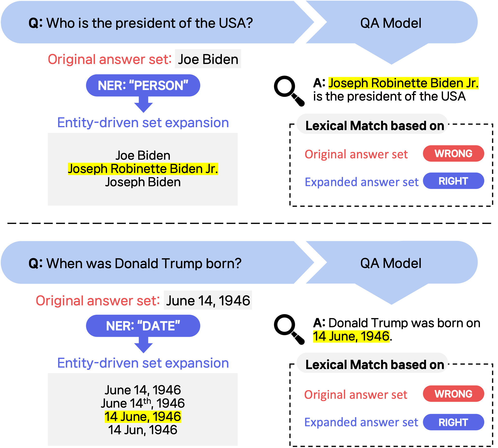

# Entity driven expansion README

This is the repository documenting the paper
[Return of EM: Entity-driven Answer Set Expansion for QA Evaluation] (https://arxiv.org/abs/2404.15650)
by Dongryeol Lee, Minwoo Lee, Kyungmin Min, Joonsuk Park, and Kyomin Jung.



# Dataset
## Data Description
  Each data point in our dataset is represented as a dictionary with the following keys:
```
  "question": The question asked in the Open-QA task.
  "golden_answer": The gold standard answers to the question (split with '/'). 
  "answer_fid", "answer_gpt35", "answer_chatgpt", "answer_gpt4", "answer_newbing": The answers generated by different models (FiD, GPT-3.5, ChatGPT-3.5, GPT-4, and New Bing, respectively).
  "judge_fid", "judge_gpt35", "judge_chatgpt", "judge_gpt4", "judge_newbing": Boolean values indicating whether the corresponding model's answer was judged to be correct or incorrect (True for correct, False for incorrect) by human.
  "ans_type": Entity type of golden answer. We utilize Spacy's NER to classify each answer-set into 19 categories.
  "fb": Answer-set expanded by utilizing the Freebase knowledge base.
  "wiki": Answer-set expanded by utilizing the Wikipedia. Only available for TriviaQA.
  "entity_expand": **Answer-set expanded by our Entity-driven Answer-set Expansion.**

```

